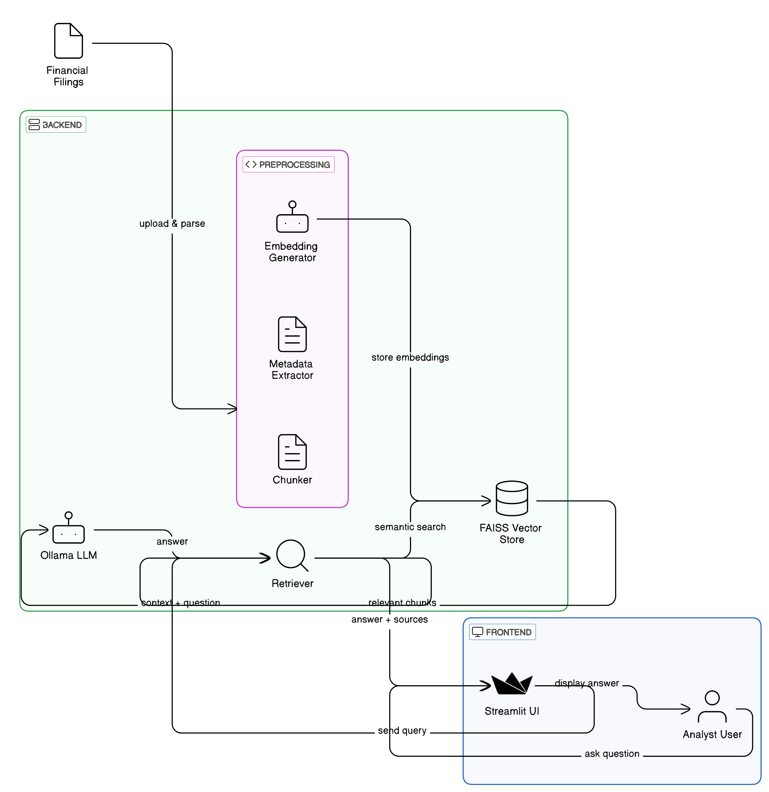

# 📄 Financial Reports Assistant

> An AI-powered assistant to retrieve and summarize critical information from company financial filings (10-Ks), built using Retrieval-Augmented Generation (RAG), Ollama local LLMs, FAISS vector database, and Streamlit.

---

# 🏢 Company History and Context

**Acme Financial Solutions**, founded in 2005, is a financial consulting company specializing in corporate financial advisory, M&A due diligence, and investment risk analysis.

Over the past years, Acme faced a growing challenge:  
With **hundreds of client companies filing thousands of pages** of 10-K reports annually,  
their analysts spent **hundreds of hours manually reading** and extracting critical insights like:

- Risk factors
- Business strategies
- Investment-related disclosures
- Revenue growth plans
- Compliance statements

⚡ This manual work was slow, expensive, error-prone, and delayed decision-making.

---

# ❗ Company Challenges

| Challenge | Impact |
|:----------|:-------|
| Manual reading of massive reports | High analyst costs (~$90/hour) |
| Delayed insights delivery | Lost competitive edge in M&A advisory |
| Human errors and oversights | Compliance and investment risks |
| No centralized knowledge base | Repetitive work across teams |

Acme needed an intelligent solution to **speed up analysis, reduce costs, and deliver better results** to clients.

---

# 🚀 Proposed Solution

We built the **Financial Reports Assistant**:

- ✅ Upload financial reports (10-Ks) in bulk.
- ✅ Automatically parse, chunk, and vectorize important sections (like Item 1, Item 1A, Item 7).
- ✅ Allow analysts to **ask questions** (e.g., "What risks did Tesla highlight in 2021?") and get **instant summarized answers**.
- ✅ Show **source documents** for auditability and compliance.

**Core: Retrieval-Augmented Generation (RAG) + local LLMs + clean UI.**


---

# 💸 Estimated Gains

| Metric | Impact |
|:-------|:-------|
| Analyst time saved per report | ~6 hours |
| Analyst cost per hour | ~$90/hour |
| Cost saved per 100 reports/year | ~$54,000 |
| Time-to-insight improvement | 5× faster |
| Competitive advantage in M&A deals | Priceless |

✅ **Estimated Annual Savings**: **$54,000 - $100,000**  
✅ **Return on Investment (ROI)**: **> 500% within 1 year**

---

# 📑 README Organization

| Section | Purpose |
|:--------|:--------|
| [Solution Details](#solution-details) | Technologies, architecture, user interface |
| [Gains Estimation](#gains-estimation) | Financial benefits analysis |
| [How to Run](#how-to-run) | Setup instructions (coming soon if needed) |

---

# 🛠️ Solution Details

---

## ⚙️ Technologies Used

| Technology | Purpose |
|:-----------|:--------|
| Python | Core programming |
| LangChain | RAG pipelines |
| FAISS | Vectorstore for semantic search |
| Ollama | Local LLMs (Mistral, Deepseek, SmolLM2) |
| HuggingFace Transformers | Embedding models |
| Streamlit | Web UI frontend |
| PyTorch | Model backends |

---

## 🏛️ Architecture



<!-- ```plaintext
[Financial Filings (10-Ks)]
         ↓
 [Load and Preprocess (chunking, metadata)]
         ↓
 [FAISS Vectorstore (embeddings)]
         ↓
 [Retriever (semantic search)]
         ↓
 [LLM via Ollama (Mistral, Deepseek)]
         ↓
 [Streamlit UI (Q&A + Source Display)]
``` -->

✅ Clean, scalable, fully local RAG architecture.  
✅ Modular, easy to maintain and extend.

---

## 🎨 User Interface

- Clean, responsive Streamlit app.
- Input box for natural language questions.
- "Ask" button triggers retrieval and generation.
- Answer displayed with source documents metadata.
- Fast, lightweight, easy to use.

---

# 💵 Gains Estimation

---

## 📈 Where to Apply

| Application | Benefit |
|:------------|:--------|
| M&A Due Diligence | Faster insights into target companies |
| Financial Risk Analysis | Rapid risk factor extraction |
| Investment Portfolio Monitoring | Real-time reporting analysis |
| Corporate Compliance Reviews | Quick audit of regulatory statements |

---

## ⏳ Time and Cost Saves

| Item | Impact |
|:-----|:-------|
| Manual reading cut by 80% | ~$90/hour saved |
| Faster client reporting | Higher client satisfaction |
| Reduced human error | Lower compliance risk |

**Example:**
- 1 analyst analyzing 100 reports manually:  
  ~600 hours/year → ~$54,000 cost/year.

- 1 analyst using Financial Reports Assistant:  
  ~100 hours/year → ~$9,000 cost/year.

✅ **Savings:** ~$45,000/year per analyst.

---

## 💹 Profit Increasing

| Area | Impact |
|:-----|:-------|
| Higher client throughput | More projects handled per analyst |
| Faster advisory services | Premium pricing opportunities |
| Lower operational costs | Increased net margins |
| Improved decision-making speed | Win more competitive deals |

✅ Real-world ROI: **5–10×** investment within the first year.

---

# 🎯 Conclusion

The **Financial Reports Assistant** transforms financial report analysis from a slow, manual bottleneck into a fast, accurate, and scalable process —  
**saving Acme Financial Solutions $50,000+ per year** and improving its competitive edge dramatically.

✅ Modular  
✅ Cost-effective  
✅ Easy to use  
✅ Ready for real-world financial operations

---

# 🏁

👉 **Ready to explore the project?**  
✅ See code organization inside `/src`.  
✅ See live app with Streamlit (`streamlit run src/streamlit_app.py`).  
✅ See how Retrieval-Augmented Generation can *transform* your business.